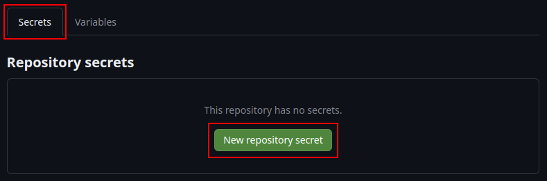

# Chapter 7: A Practical Pipeline for Technical Release Managers

In this guide, you will be shown how to build a docker image containing a simple web application that deploys to AWS EC2, using GitHub Actions. The strategy to accomplish this will be broken down into two parts. First, you will be shown how to provision the necessary EC2 . Second, you will be shown how to configure the GitHub Actions workflow that is necessary to test, build and then deploy the docker container into EC2. Together, these two exercises will culminate in your successfull utilization of the fundemental concepts used in contemporary application delivery.

---
##### Table of contents:

[Provision the AWS Infrastructure](#Provision-the-AWS-Infrastructure)
  1. [Step 1 - Fork this Repository](#Step-1---Fork-this-Repository)
  2. [Step 2 - Create a Default VPC](#Step-2---Create-a-Default-VPC)
  3. [Step 3 - Create an HTTP Rule in the Default Security Group](#Step-3---Create-an-HTTP-Rule-in-the-Default-Security-Group)
  4. [Step 4 - Create an ECR Registry](#Step-4---Create-an-ECR-Registry)
  5. [Step 5 - Create an ECS Cluster](#Step-5---Create-an-ECS-Cluster)
  6. [Step 6 - Create an ECS Task Definition](#Step-6---Create-an-ECS-Task-Definition)
  7. [Step 7 - Create an ECS Service](#Step-7---Create-an-ECS-Service)
     
[Configure the GitHub Actions Workflow](#Configure-the-GitHub-Actions-Workflow)
  1. [Step 1 - Configure the Necessary GitHub Repository Variables and Secrets](#Step-1---Configure-the-Necessary-GitHub-Repository-Variables-and-Secrets)
  2. [Step 2 - Kick Off a GitHub Actions Workflow](#Step-2---Kick-Off-a-GitHub-Actions-Workflow)
  3. [Step 3 - Analyze Deployment Logs](#Step-3---Analyze-Deployment-Logs)
  4. [Step 4 - Observe the Deployed Application-Running-in-AWS-EC2](#Step-4---Observe-the-Deployed-Application-Running-in-AWS-EC2)

---

## Provision the AWS Infrastructure
To ensure that this exercise is approachable for as wide of an audience as possible, we will be using ClickOps to provision all of the necessary infrastructure in AWS. ClickOps is the term used to describe the process of manually provisioning cloud resources using the providers native web console. As the name suggests, this proceess involves inputting all off the neccessary information using keyboard and mouse. ClickOps is widely considered to be an anti-pattern in the world of DevOps, primarily because it is drastically more inefficient and prone to errors than using Infrastructure-as-Code. However, it is extremely helpful for individuals who do not know how to script, write code or use the commandline interface.

### Prerequisets
To complete this phase of the guide, you will need to ensure the following prerequistes are met:

  - You have an active [AWS account](https://console.aws.amazon.com/console/home?nc2=h_ct&src=header-signin) that is in good standing.
  - Your AWS IAM user holds an active set of Access Keys.
    - For more information, see [Managing access keys for IAM users](https://docs.aws.amazon.com/IAM/latest/UserGuide/id_credentials_access-keys.html).
  - Your AWS IAM user must be granted the necessary roles that permit it the ability to provision EC2, ECR and VPC resources in AWS.
    - For more information, see [Identity-based policy examples for Amazon Elastic Container Service](https://docs.aws.amazon.com/AmazonECS/latest/developerguide/security_iam_id-based-policy-examples.html#IAM_cluster_policies).
  - For this exercise, the `AmazonEC2ContainerRegistryFullAccess`, `AmazonEC2FullAccess` and `AmazonECS_FullAccess` policies should be all that are needed for the purposes of following this guide, in additon to being an administrative user in your AWS account.
    
    
  
---

### Step 1 - Fork this Repository
  1. [Fork](https://github.com/Joeltrane/embracing-devops-release-management/fork) this GitHub repository.
     - Click on the drop down arrow in the fork box and choose **Create a new fork**. Or, click [this link](https://github.com/Joeltrane/embracing-devops-release-management/fork).
       
       
     - In the fork repo page, choose an **Owner** and select **Create fork**.
       
       

[back to top](#Table-of-contents)

### Step 2 - Create a Default VPC

If you already have a default VPC in the Region, you cannot create another one. If you've deleted your default VPC, you can create a new one, but you cannot restore a previous default VPC that you deleted, and you cannot mark an existing non-default VPC as a default VPC.

**To create a default VPC using the console:**
  
  
  1. Open the Amazon VPC console at https://console.aws.amazon.com/vpc/.
  2. In the navigation pane, choose **Your VPCs**.
  3. Choose **Actions**, **Create default VPC**.
  4. Select **Create default VPC**. Close the confirmation screen.
     
     

[back to top](#Table-of-contents)

### Step 3 - Create an HTTP Rule in the Default Security Group
When you add a rule to a security group, the new rule is automatically applied to any resources that are associated with the security group.

**To add a rule using the console**
  1. Open the Amazon VPC console at https://console.aws.amazon.com/vpc/.
  2. In the navigation pane, choose **Security groups**.
     
     
  4. Select the security group.
  6. Choose **Actions**, **Edit inbound rules**.
     
     
  8. Choose **Add rule** and do the following:
      - For **Type**, choose the type of protocol to allow.
        - In our case, select **HTTP**.
      - For **Source type** (inbound rules) do the following to allow traffic:
        - Choose **Anywhere-IPv4** to allow traffic from any IPv4 address (inbound rules). This automatically adds a rule for the 0.0.0.0/0 IPv4 CIDR block.
      - (Optional) For **Description**, specify a brief description for the rule.
        
        
  9. Choose **Save rules**.

[back to top](#Table-of-contents)

### Step 4 - Create an ECR Registry
Get started with Amazon ECR by creating a repository in the Amazon ECR console. The Amazon ECR console guides you through the process to get started creating your first repository.
Before you begin, be sure that you've completed the steps in [Setting up with Amazon ECR](https://docs.aws.amazon.com/AmazonECR/latest/userguide/get-set-up-for-amazon-ecr.html).

**To create an image repository**

A repository is where you store your Docker or Open Container Initiative (OCI) images in Amazon ECR. Each time you push or pull an image from Amazon ECR, you specify the repository and the registry location which informs where to push the image to or where to pull it from.

  1. Open the Amazon ECR console at https://console.aws.amazon.com/ecr/.
  2. From the navigation bar, select the **Region** to use.

     
  3. Choose **Get Started**.
  4. For **Visibility settings**, choose **Private**.
  5. For **Repository name**, specify a name for the repository.
     - To ensure that this exercise goes smoothly, it is strongly suggested that you choose the following ECR **Repository name** when following this guide: `embracing-devops-release-management`.
     
       > IMPORTANT:
       >
       > Make a note of the 12 digit number shown at the beginning of your ECR repository name. This is your AWS account number and you will need it to complete future steps in this guide.
       >
       > Alternatively, you can browse to your [AWS account page](https://console.aws.amazon.com/billing/home?#/account) to obtain your AWS account number.
  6. For **Tag immutability**, choose to leave it disabled.

     
  7. For **Scan on push**, your may choose to enable the image scanning setting for the repository, or leave it disabled. Repositories configured to scan on push will start an image scan whenever an image is pushed, otherwise image scans need to be started manually.
  8. For **KMS encryption**, choose to leave it disabled.

     
  10. Choose **Create repository**.

[back to top](#Table-of-contents)

### Step 5 - Create an ECS Cluster
You can create an Amazon ECS cluster using the Amazon ECS console. Before you begin, be sure that you've completed the steps in Set up to use Amazon ECS and assign the appropriate IAM permission. For more information, see Cluster examples. The Amazon ECS console provides a simple way to create the resources that are needed by an Amazon ECS cluster by creating a AWS CloudFormation stack.

To make the cluster creation process as easy as possible, the console has default selections for many choices which we describe below. There are also help panels available for most of the sections in the console which provide further context.

**To create a new cluster (Amazon ECS console)**
  1. Open the console at https://console.aws.amazon.com/ecs/v2.
  2. From the navigation bar, select the **Region** to use.

     
  4. In the navigation pane, choose **Clusters**.
  5. On the **Clusters** page, choose **Create cluster**.

     
  6. Under **Cluster configuration**, configure the following:
     - For **Cluster name**, enter a unique name.
     - To ensure that this exercise goes smoothly, it is strongly suggested that you choose the following ECS **Cluster name** when following this guide: `embracing-devops-release-management`.
  7. Expand **Infrastructure**, and then select **AWS Fargate (serverless)**.

     
  8. (Optional) To turn on Container Insights, expand **Monitoring**, and then turn on **Use Container Insights**.
  9. (Optional) To help identify your cluster, expand **Tags**, and then configure your tags.
       - [Add a tag] Choose **Add tag** and do the following:
         - For **Key**, enter the key name.
         - For **Value**, enter the key value.
       - [Remove a tag] Choose **Remove** to the right of the tag’s Key and Value.

       
   10. Choose **Create**.

[back to top](#Table-of-contents)

### Step 6 - Create an ECS Task Definition
To make creating task definitions as easy as possible, the Amazon ECS console has default selections for many choices, as described later. There are also help panels available for most of the sections in the console, which provide further context.

You can create a task definition by using the console, or by editing a JSON file.

**To create a task definition using Amazon ECS console JSON editor**
  1. From the navigation bar, select the **Region** to use.

     
  2. First, edit the **ECS Task Definiton file** in your forked repository.
     - From GitHub, click into the [task-definition.json](task-definition.json) file, within this repository.
     - From the [task-definition.json](task-definition.json) file page, click on the **Pencil** icon to edit the file.

       
     - Locate the two placeholders for your AWS account ID, represented as a string of 12 consectuive "X" characters.

       
     - Replace the two placeholders for your AWS account ID with your actual AWS account ID and select **Commit changes**.

       > NOTE!:
       >
       > You can browse to your [AWS account page](https://console.aws.amazon.com/billing/home?#/account) to obtain your AWS account number.

       
     - Within the commit confirmation menu, add a meaningful **commit message**, select **Commit directly to the `main` branch**.

       
     - Then, choose **Commit changes**.
  3. Open the console at https://console.aws.amazon.com/ecs/v2.
  4. In the navigation pane, choose **Task definitions**.
  5. On the **Create new task definition** menu, choose **Create new task definition with JSON**.

     
  6. In the JSON editor box, edit your JSON file.
     - Copy the [task-definition.json](task-definition.json) file from this repository that you edited earlier, and paste it into the JSON editor box.

       > NOTE!:
       > 
       > If there is already content in the JSON editor box prior to pasting your customized task-definition.json file into it, ensure that it is removed first.
       > The JSON editor box must be empty before adding your task-definition.json contents into it.

       
     
       
  7. Choose **Create**.

[back to top](#Table-of-contents)

### Step 7 - Create an ECS Service
You can use the console to quickly create and deploy a service. The service has the following configuration:
  - Deploys in the VPC and subnets associated with your cluster.
  - Deploys one task.
  - Uses the rolling deployment.
  - Uses the capacity provider strategy with your default capacity provider.
  - Uses the deployment circuit breaker to detect failures and sets the option to automatically roll back the deployment on failure
To deploy a service using the default parameters follow these steps.

**To create an ECS service (Amazon ECS console):**
  1. From the navigation bar, select the **Region** to use.

     
  2. Open the console at https://console.aws.amazon.com/ecs/v2.
  3. In the navigation page, choose **Clusters**.
  4. On the **Clusters** page, choose the cluster to create the service in.
  5. From the **Services** tab, choose **Create**.

     
  6. Under **Deployment configuration**, specify how your application is deployed.

       
     - For **Compute options**, select **Launch type**.
  
       
     - For **Application type**, choose **Service**.
     - For **Task definition**, choose the task definition family and revision to use.
     - For **Service name**, enter a name for your service.
         - To ensure that this exercise goes smoothly, it is strongly suggested that you choose the following ECS **Service name** when following this guide: `embracing-devops-release-management`.
     - For **Desired tasks**, enter the number of tasks to launch and maintain in the service.
     - For **Networking**, the default VPC and it's associated networking  should automatically populate within the fields. However, ensure that the configuration is configured similarly to the example below:
  
       
  7. (Optional) To help identify your service and tasks, expand the **Tags** section, and then configure your tags.
     - Add or remove a tag.
       - [Add a tag] Choose **Add tag**, and then do the following:
         - For **Key**, enter the key name.
         - For **Value**, enter the key value.
      - [Remove a tag] Next to the tag, choose **Remove tag**.
  8. Choose **Create**.

[back to top](#Table-of-contents)

---

## Configure the GitHub Actions Workflow
There are a number of configurations that will need to be made in order to successfully run the GitHub Actions Workflow and achieve a successful deployment. Primarily among these are input parameters, which take the form of variables and secrets. Notably, secrets function almost identically as variables, except they are masked in the logs and visible to no one, once they have been configured in the repository settings. Once you are able to successfully initiate a pipeline run, be sure to examine the logging output to verify any issues, failures and successes. Finally, you will be able to observe the functioning web application running in in AWS EC2.

### Prerequistes
To complete this phase of the guide, you will need to ensure the following prerequistes are met:
  - You have an active [GitHub account](https://github.com/) that is in good standing.

### Step 1 - Configure the Necessary GitHub Repository Variables and Secrets
  1. In Github, navigate to the **Settings** menu of this repository.

     

  2. Enable GitHub **Issues** for this repository and select **Save**.

     
  
  3. In the **Security** section of the repository menu, navigate to the **Secrets and variables** option.

     

     - Choose **Actions**.
  5. In the **Actions secrets and variables** menu choose the **Secrets** tab.
     - Select **New repository secret**.
  
       
  6. Create a new repository secret for your AWS access key ID.
     - In the **Name** field, enter the vairable **AWS_ACCESS_KEY_ID**.
     - In the **Secret** field, enter the value for your AWS access key ID.
     - Choose **Add secret**.

       
  7. Create a new repository secret for your AWS secret access key ID.
     - In the **Name** field, enter the vairable **AWS_SECRET_ACCESS_KEY**.
     - In the **Secret** field, enter the value for your AWS secret access key.
     - Choose **Add secret**.

       
  8. In the **Actions secrets and variables** menu choose the **Variables** tab.
     - Select **New repository variable**.
  
       
  9. Create a new repository variable for your **ECR Repository**.
     - In the **Name** field, enter the variable **ECR_REGISTRY**.
     - In the **Value** field, enter the value for your ECR repository address (This is the same value from step 3, of the **Provision the AWS** section of this guide).
     - Choose **Add variable**.

       

     > NOTE:
     >
     > Don't forget to use your own AWS account id in the full ECR repository address when entering it into the text box.

  10. Enter the remaining repository variables that are necessary for the pipeline to operate successfully.
      
      - Repeate the process for step 7 until all of the remaining repository variables have been added.
  
        

      - The table below contains all of the required **Variable** names and _**their suggested**_ values:

        | Variable Name | Variable Value |
        | ------------- | -------------- |
        | **ECR_REGISTRY** | XXXXXXXXXXXX.dkr.ecr.us-east-1.amazonaws.com |
        | **MY_AWS_REGION** | us-east-1 |
        | **MY_CONTAINER_NAME** | embracing-devops-release-management |
        | **MY_ECR_REPOSITORY** | embracing-devops-release-management |
        | **MY_ECS_CLUSTER** | embracing-devops-release-management |
        | **MY_ECS_SERVICE** | embracing-devops-release-management |
        | **MY_ECS_TASK_DEFINITION** | ./task-definition.json |

         > NOTE:
         >
         > Ensure that "./" is appended to the beginning of the **Value** set for the variable, _**MY_ECS_TASK_DEFINITION**_. This is a necessary filesystem path and it is valid syntax required for GitHub Actions to pick up the task-definition.json file and use it in the pipeline.

[back to top](#Table-of-contents)

### Step 2 - Kick Off a GitHub Actions Workflow
1. Navigate to the GitHub **Actions** menu.

   

2. Select **I understand my workflows, go ahead and enable them**.

   

3. From the **All workflows** menu, in **Actions**, choose the workflow for this excercise **Deploy to Amazon ECS**.

   
4. In the **Deploy to Amazon ECS** workflow menu, choose **Run workflow**, then select **Run workflow**.

   
5. After the workflow run begins, click into the build logs.

   

[back to top](#Table-of-contents)

### Step 3 - Analyze Deployment Logs
  1. After the GitHub Actions workflow has been initiated, click into the pipeline phases to observe the logs for failures, issues and successes!

     

     
  
     

     

     

     

     

     

[back to top](#Table-of-contents)

### Step 4 - Observe the Deployed Application-Running-in-AWS-EC2
Now that the GitHub Actions workflow has run to completion and the web app is deployed to ECS, let's open a browser window and observe our handy work.

  **There are two easy ways that you can obtain the correct address of your running web application:**

  1. After looking back in the deployment logs, you can find the IP address that was used to scan the running web application when an automated scan was performed with OWASP ZAProxy.

     

  2. Open up the AWS web console and obtain the IP address from the ECS service.
     - Open the console at https://console.aws.amazon.com/ecs/v2.
       > NOTE!:
       >
       > Don't forget to select the correct AWS region that your ECS cluster was deployed in.

       
     - Navigate to your ECS cluster.
   
       
     - Click into the ECS Task associated with your web app deployment.
   
       
     - Click into the current deployment hash number associated with your ECS Taks deployment.
   
       
     - Look under the **Public IP** heading to obtain your web app's public IP address.
   
       
     - Browse to the app and experience it for yourself. Enjoy!
   
       

[back to top](#Table-of-contents)

    

---

## Resources

- https://docs.aws.amazon.com/AmazonECS/latest/userguide/getting-started-fargate.html
- https://docs.aws.amazon.com/AmazonECS/latest/userguide/create-container-image.html
- https://docs.aws.amazon.com/AmazonECS/latest/userguide/get-set-up-for-amazon-ecs.html
- https://docs.github.com/en/actions/deployment/deploying-to-your-cloud-provider/deploying-to-amazon-elastic-container-service
- https://earthly.dev/blog/github-actions-and-docker/
